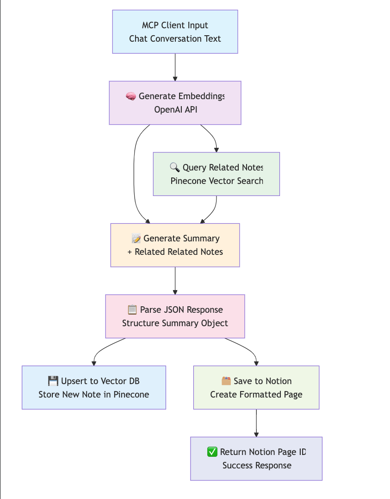

# MCP: Cornell Resume

A Model Context Protocol (MCP) server that automatically generates Cornell-style study notes and summaries from the conversational context, with RAG active recall question generation and Notion integration.

## Features

The server processes text from the conversational context, generates contextual summaries, creates active recall questions (context-aware), and automatically saves everything to your Notion.

- Real-time Cornell-style note generation from the client chat conversation history
- Context-aware active recall question generation using vector similarity
- Semantic search integration with Pinecone for relevant note retrieval
- Automatic Notion database synchronization with proper block formatting
- OpenAI-powered text processing and question generation

## Setup Guide

### Requirements

- Python 3.13+
- [uv](https://github.com/astral-sh/uv)
- OpenAI account
- Pinecone account

### Installation

1. **Clone the repository**

```bash
git clone
cd mcp-cornell-resume
```

2. **Install dependencies**

```bash
# Create virtual environment
uv venv
source venv/bin/activate  # On Windows: venv\Scripts\activate

# Install required packages
uv pip sync docs/requirements.txt
```

3. **Environment Configuration** - Create a `.env` file in the project root:

```env
OPENAI_API_KEY=your_openai_api_key
PINECONE_API_KEY=your_pinecone_api_key
PINECONE_INDEX_NAME=cornell-notes
NOTION_API_KEY=your_notion_api_key
NOTION_DATABASE_ID=your_database_id
```

4. **Set up Notion**

- Create a Notion Integration at the notion developers page (Set appropriate capabilities at minimum, select "Read content" and "Update content").
- Get your API Key
- Share Pages with your Integration.
- Get the database key of the page: You will find the database in in the link of the page.

5. **Configure Pinecone Index** - Create a Pinecone index with:

- Dimension: 1536 (for OpenAI embeddings)
- Index name matching your `.env` configuration

## Usage

### Using with Claude Client Desktop or other MCP-compatible applications

Add this to your MCP configuration JSON file:

```bash
code ~/Library/Application\ Support/Claude/claude_desktop_config.json
```

```json
{
  "mcpServers": {
    "resume_to_notion": {
      "command": "/Users/<USER></USER>/.local/bin/uv",
      "args": [
        "--directory",
        "/<PATH_TO_PROJECT/mcp-cornell-resume",
        "run",
        "main.py"
      ]
    }
  }
}
```

## Available Tools

### save_resume_to_notion

Summarize the full ongoing chat conversation in send it as 'text'.

**Parameters**:

- `text`: text string a resume of the client chat window.

**Return**:

- `notion_page_id`

## How It Works

### Process Flow

1. **Input Processing**: The MCP client sends chat conversation text to the `save_resume_to_notion` tool
2. **Embedding Generation**: OpenAI creates vector embeddings from the input text content
3. **Context Retrieval**: Pinecone searches for semantically similar existing notes using the embeddings
4. **Cornell Summary Generation**: OpenAI generates a structured Cornell-style summary using:
   - Original conversation content
   - Related notes from Pinecone for context awareness
5. **Vector Storage**: The new note is stored in Pinecone with its embeddings for future context retrieval
6. **Notion Integration**: The formatted Cornell summary is saved to your Notion database
7. **Response**: Returns the Notion page ID to the client

### Visual Flow Diagram



## Development

You can use the Model Context Protocol inspector to try out the server:

```bash
fastmcp dev main.py
```

## Limitations and Future Improvements

- LLM Context Window Limitations: The MCP client has a finite context window (typically 8k-32k tokens depending on the model).
- If a chat session is too long, summarizing only the available context might lose important information.
- Latency in Multi-Integration Workflows: Each integration adds latency and increases the risk of slower processing.
- Notion and Pinecone Sync Complexity.
- Create a tag RAG feature for the notes.

## Security Considerations

- **API Key Management**: Store all API keys securely in `.env`
- **Input Validation**: All inputs are sanitized and validated
- **Error Handling**: Sensitive information is never exposed in errors
- **Access Control**: Notion integration respects workspace permissions
- **Data Privacy**: No chat content is permanently stored without consent

## License

MIT License
